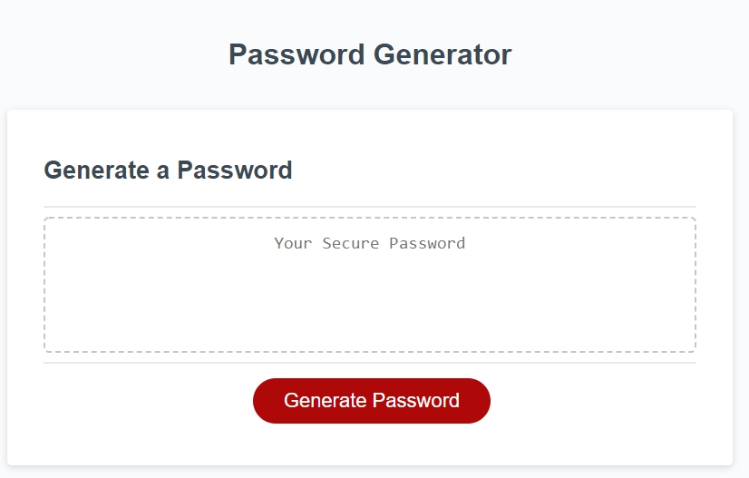
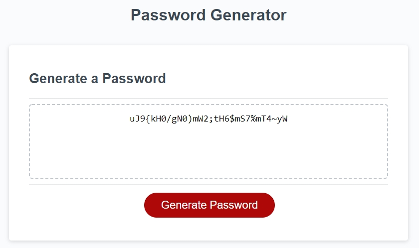

# Secure-Password-Generator

* This application allows the user to generate a Secure password in base of a certain criteria chosen by the user. The criteria contemplates if the password will have lower and upper case letters, numbers and special characters.

# ABOUT THIS PROYECT AND TECNOLOGIES

* This app allows anybody to have and use secure passwords and that solves the problem of many users who use very weak passwords.

* This web was created with HTML, CSS and JavaScript.

* I added properly comments for both HTML and JavaScript.

* Clean code.

* The app has a responsive web desing for large, medium and small screen sizes.

# Link to the app https://angelmond.github.io/Secure-Password-Generator/

# SCREENSHOTS
;
;
